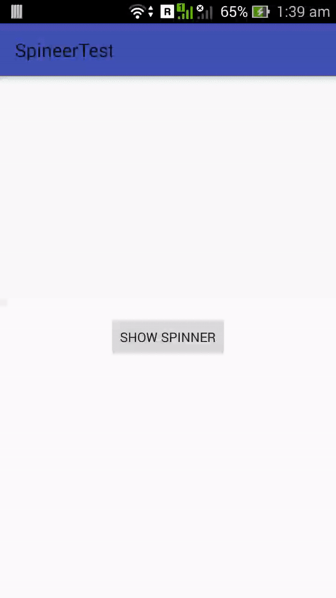

# SpinnerIOS
Spinner like IOS in Android

## Demo

 ## Usage
   ### Step 1 : Add "SpinnerIOS" to your Android project.

   1- Open your project in Android Studio.
   2- Download the library
       (using Git Link ---> https://github.com/yash786agg/SpinnerIOS.git)
                                        or 
       (Download a zip File archive to unzip)
    
   3- Create a folder "SpinnerIOS" in your project.
   4- Copy and paste the Code to your SpinnerIOS folder
   5- On the root of your project directory create/modify the settings.gradle file. It should contain something like the following:

      include 'MyApp', ':SpinnerIOS'

   6- Go to File > Project Structure > Modules.
   7- App > Dependencies.
   8- Click on the more on the left green "+" button > Module dependency.
   9- Select "SpinnerIOS Library".
   
   ### Step 2 : Add Code to your Project
   
   Activity Code: 
   
  Step 1:  implements SpinnerWindow_interface

   Step 2: Intialize ArrayList and add data into arraylist accordingly.
   
       ArrayList<String> dataArray = new ArrayList<>();
       
       dataArray =  {"1 Second","2 Seconds","3 Seconds","4 Seconds","5 Seconds","6 Seconds","7 Seconds","8 Seconds","9 Seconds","10 Seconds"};
       
        Button show_spinner = (Button) findViewById(R.id.show_spinner);
        show_spinner.setOnClickListener(new View.OnClickListener()
        {
            @Override
            public void onClick(View v)
            {
                new SpinnerWindow(MainActivity.this);

                SpinnerWindow.showSpinner(MainActivity.this,dataArray);
            }
        });
        
   /**Below "selectedPosition" is the Override method of SpinnerWindow_interface Where you will get the Selected Position
      from the Spinner**/     

    @Override
    public void selectedPosition(int selected_position)
    {
        Toast.makeText(MainActivity.this,dataArray.get(selected_position),Toast.LENGTH_SHORT).show();
    }
}

xml code:

 <Button
        android:id="@+id/show_spinner"
        android:layout_width="wrap_content"
        android:layout_height="wrap_content"
        android:text="Show Spinner"
        android:layout_centerInParent="true"/>

